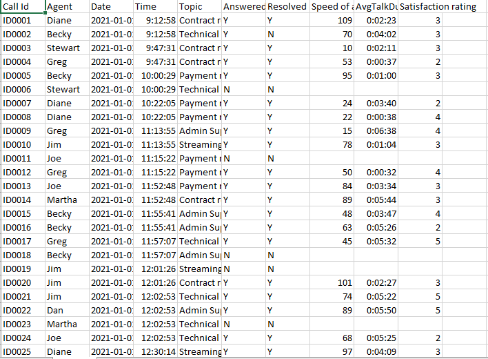
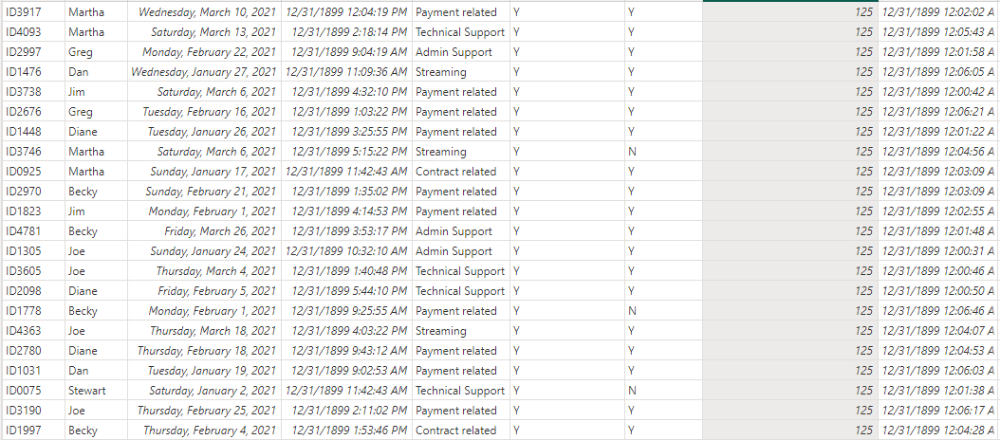
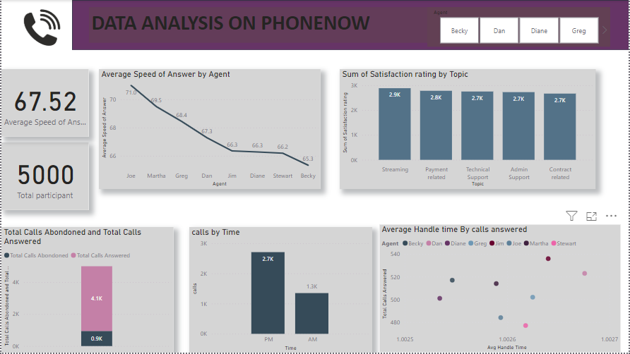

# Analysis-on-phonenow-Dataset

## ANALYZING CALL CENTER PERFORMANCE
# Introduction
During my internship at Phonenow, I worked on this dataset which was gotten from Phonenow, focusing on analyzing call center performance data. One of my key tasks was using data analytics tools to evaluate various aspects of customer support interactions, such as call resolution time, agent performance, and customer satisfaction. I was responsible for cleaning, transforming, and analyzing large datasets to provide actionable insights that would enhance operational efficiency and customer experience.
# DATA SOURCE
The data for this project was sourced from Phonenow as part of my internship assignment. It is an Excel file that contains detailed information on customer support interactions, including call logs, agent responses, resolution status, and customer satisfaction ratings. The dataset is a vital part of analyzing call center performance and understanding customer experience.
I imported this data into Power BI (PBI) for further processing. Using Power BI, I performed data cleaning and transformation tasks to ensure data quality and consistency. This includes handling missing values, correcting discrepancies, and structuring the data for more effective analysis. The goal is to extract actionable insights that can be used to optimize call center operations and improve customer satisfaction.
# Tools:
# 1.	Microsoft Excel:
a.	Initial data source provided in Excel format.
b.	Uploaded into Power BI for further processing and analysis.
•	Power BI:
o	Used for data cleaning, transformation, analysis, and visualization.
o	Key components used:
	Power Query: For data preprocessing (cleaning, categorization, time grouping).
	DAX (Data Analysis Expressions): For creating calculated columns, measures, and custom KPIs.
	Power BI Visuals: For creating charts, scatter plots, performance quadrants, and other visualizations.
# 2. Data Cleaning and Transformation:
•	Power Query:
o	Handled missing data and formatting.
o	Extracted key time components such as AM/PM.
•	DAX Formulas:
o	Created calculated columns and measures:
	Time-Based Calculations: Call Hour, AM/PM Categorization, Time Blocks.
	Performance Metrics: Calls Answered, Calls Abandoned, Avg Handle Time.
	Customer Satisfaction Metrics: Average Satisfaction Score.
# 3. Visualizations:
•	Scatter Plot:
o	Used for Agent Performance Quadrant, showing Avg Handle Time vs. Total Calls Answered.
•	Stacked Column Chart:
o	Displayed Calls Answered vs. Calls Abandoned, Satisfaction rate by Topic, Calls by Time
•	Line Chart:
o	Used to analyze Speed of Answer trends.

# Data Cleaning and Transformation
As part of my internship project at Phonenow, I performed extensive data cleaning and transformation on the provided dataset to ensure accuracy, consistency, and readiness for analysis. This process was carried out using Power BI and its Power Query Editor. Below is a summary of the steps taken during this phase:
# 1. Importing the Dataset
•	The dataset was originally provided in Excel format.
•	I uploaded the file into Power BI and ensured that the data structure, such as column names and data types, was properly recognized.
# 2. Data Cleaning
To improve the quality of the data, I performed the following steps:
•	Handling Missing Values:
o	Missing values in columns such as Speed of Answer and Satisfaction Rating were identified.
o	Appropriate actions were taken, such as imputing missing values with averages or removing unusable rows.
•	Standardizing Data Types:
o	Columns such as Time, Date, and Call Duration were converted to the correct formats (Date/Time).
o	Text-based columns like Agent and Topic were cleaned to remove any inconsistencies (e.g., unnecessary spaces).
•	Removing Duplicates:
o	Duplicate rows were identified and removed to ensure data integrity.
# 3. Data Transformation
To prepare the data for deeper analysis and visualization, I applied the following transformations:
•	Extracting Time Components:
o	From the Time column, I extracted Hour and categorized the data into AM/PM time blocks using DAX.
	Formula:
DAX
Copy code
AM/PM = IF(HOUR('Dataset'[Time]) < 12, "AM", "PM")  
•	Adding Measures:
o	To calculate important KPIs, I used DAX measures, such as:
	Total Calls Answered:
DAX
Copy code
Calls Answered = COUNTROWS(FILTER('Dataset', 'Dataset'[Answered] = "Y"))  
	Average Handle Time:
DAX
Copy code
Avg Handle Time = AVERAGE('Dataset'[Talk Duration])  
•	Grouping Data:
o	I grouped the call times into predefined time Period such as AM & PM.

# Data Description
The dataset provided as part of my internship project at Phonenow contains detailed records of call center operations. The data, originally in Excel format, was imported into Power BI for analysis and visualization. Below is a comprehensive description of the dataset and its key components:
# 1. Overview of the Dataset
The dataset records the activities of call center agents, covering various aspects of call performance, customer interactions, and satisfaction levels. It includes fields for agent performance metrics, call handling details, and customer feedback.
# 2. Key Variables
•	Call Id:
o	A unique identifier for each call in the dataset.
o	Ensures every call can be tracked individually.
•	Agent:
o	The name of the call center agent who handled the call.
o	Helps in analyzing agent-specific performance metrics.
•	Date:
o	The date on which the call was made or received.
o	Useful for identifying daily and weekly call trends.
•	Time:
o	The exact time the call took place.
o	Enables analysis of call volume by hour, AM/PM categories, and peak call periods.
•	Topic:
o	The subject or reason for the call (e.g., Technical, Contract, Payment, Admin Support, Streaming).
o	Allows for classification and grouping of calls to identify common issues or trends.
•	Answered (Y/N):
o	Indicates whether the call was answered (Y) or abandoned (N).
o	Useful for calculating call center efficiency and missed opportunities.
•	Resolved (Y/N):
o	Indicates whether the issue raised during the call was resolved (Y) or unresolved (N).
o	A critical metric for analyzing resolution rates and customer satisfaction.
•	Speed of Answer:
o	The time taken (in seconds) for the call to be answered.
o	Helps evaluate the efficiency of the call center in addressing customer calls promptly.
•	Avg Talk Duration:
o	The average duration (in minutes) spent talking to the customer during the call.
o	A key performance indicator for agent workload and efficiency.
•	Satisfaction Rating:
o	Customer feedback on their satisfaction with the call experience, measured on a scale of 1 to 5:
	1: Very Dissatisfied
	2: Dissatisfied
	3: Neutral
	4: Satisfied
	5: Very Satisfied
o	Used to gauge overall customer satisfaction and agent performance.
## Problem Statement
The call center plays a critical role in providing customer support, resolving inquiries, and ensuring a seamless customer experience. However, analyzing and improving call center performance can be challenging without proper insights into key metrics such as call handling efficiency, customer satisfaction, and agent performance.
The dataset reveals several areas of concern and opportunities for improvement:
# 1.	High Call Abandonment Rates
o	A significant number of calls remain unanswered, which could lead to customer dissatisfaction and missed business opportunities.
# 2.	Agent Performance Variability
o	There are noticeable differences in agent efficiency, measured by average talk duration, calls answered, and issue resolution rates. Identifying underperforming agents is essential to provide targeted training and improve overall performance.
# 3.	Customer Satisfaction Gaps
o	Satisfaction ratings vary across calls, indicating inconsistencies in the quality of support provided. Understanding the factors driving dissatisfaction is necessary to enhance service quality.
# 4.	Call Resolution Issues
o	Not all calls result in successful issue resolution, which impacts the customer experience and increases repeat calls.
# 5.	Uneven Workload Distribution
o	Analyzing call volumes and trends by time of day (AM/PM) can help identify peak hours, where agents may be overwhelmed, leading to delays and inefficiencies.
# 6.	Topic-Specific Challenges
o	Calls related to specific topics such as technical issues, payment support, or streaming queries may have lower resolution rates or higher talk durations. These topics need targeted solutions to improve support efficiency.
## Findings/Results
The analysis of the call center dataset provided critical insights into agent performance, customer satisfaction, and operational efficiency. Below are the key finding
# 1. Call Answering and Abandonment Rates
•	Total Calls Answered: The majority of calls were successfully answered, with specific agents handling a significantly higher volume of calls.
•	Abandonment Rate: A noticeable number of calls were unanswered, particularly during peak hours, indicating the need for better resource allocation to manage workload.
# 2. Agent Performance Analysis
•	Using the Performance Quadrant analysis, agents were categorized based on:
o	Average Talk Duration (Average Handle Time)
o	Total Calls Answered
•	Top Performing Agents: Some agents demonstrated high efficiency by answering more calls with shorter average talk durations.
•	Improvement Areas: A few agents had longer talk durations but resolved fewer calls, indicating potential training needs or inefficiencies.
# 3. Customer Satisfaction
•	Satisfaction Ratings: The analysis revealed varying levels of customer satisfaction, with ratings ranging between 2 and 5.
o	High Satisfaction: Calls with shorter talk durations and successful issue resolutions had higher satisfaction ratings (4–5).
o	Low Satisfaction: Calls with longer durations or unresolved issues contributed to lower satisfaction (2–3).
•	Agent Impact: Agents with consistent performance had higher satisfaction ratings, highlighting their ability to provide quality support.
# 4. Call Distribution by Time
•	Calls were categorized into AM and PM slots to analyze time-based trends:
o	Peak Hours: A higher volume of calls occurred during AM hours. This caused delays in answering calls and higher abandonment rates.
o	Low-Traffic Hours: PM hours had relatively fewer calls, offering opportunities for task redistribution to manage workloads better.
# 5. Topic-Specific Insights
•	Calls were grouped into categories such as Contract, Technical, Payment, Admin Support, and Streaming:
o	Payment and Technical Issues: These topics had longer average handle times and lower resolution rates, suggesting they require more resources or better training.
o	Admin Support Calls: These were handled efficiently, with higher resolution rates and shorter durations.
#6. Average Speed of Answer
•	The analysis of Average Speed of Answer revealed areas where agents were quicker to respond, resulting in higher customer satisfaction. However, delays during peak hours negatively impacted overall performance.

## Recommendations
Based on the analysis of the call center dataset, the following recommendations are proposed to improve operational efficiency, enhance customer satisfaction, and optimize agent performance:
# 1. Improve Resource Allocation During Peak Hours
•	Observation: A higher volume of calls occurred during the AM hours, leading to delays and increased call abandonment rates.
# •	Recommendation:
o	Increase staffing levels during peak hours to manage the call load more effectively.
o	Implement a shift-based strategy where agents are assigned based on historical peak call trends.
o	Leverage automated systems or chatbots for common queries to reduce agent workload during peak times.
# 2. Targeted Training for Agents
•	Observation: Certain agents had longer Average Handle Times (AHT) and resolved fewer calls, particularly for Technical and Payment issues.
# •	Recommendation:
o	Conduct targeted training sessions to improve agent proficiency in handling Technical and Payment-related topics.
o	Provide knowledge resources, tools, and FAQs to help agents resolve complex queries faster.
o	Monitor agent performance and provide continuous feedback and coaching to improve efficiency.
# 3. Enhance Customer Satisfaction
•	Observation: Calls with longer durations and unresolved issues led to lower customer satisfaction ratings (2–3).
# •	Recommendation:
o	Set goals to reduce Average Talk Duration while maintaining quality.
o	Introduce a post-call feedback system to gather insights from customers and identify areas for improvement.
o	Implement a priority system to escalate unresolved issues for quicker resolution.
# 4. Optimize Call Resolution for Specific Topics
•	Observation: Issues related to Technical Support and Payments were identified as areas with low resolution rates.
# •	Recommendation:
o	Assign subject matter experts or specialized teams to handle Technical and Payment-related issues.
o	Provide agents with advanced tools, troubleshooting guidelines, and support from senior staff to speed up issue resolution.
o	Analyze recurring customer problems in these categories to identify root causes and create long-term solutions.
# 5. Improve Call Monitoring and Agent Performance Tracking
•	Observation: Variations in agent performance were observed, with some agents outperforming others significantly.
# •	Recommendation:
o	Use performance dashboards to monitor agent performance on metrics like Calls Answered, Average Handle Time, and Customer Satisfaction.
o	Reward high-performing agents to motivate consistent performance.
o	Identify agents in the low-performing quadrant and provide tailored training or mentorship programs.
# 6. Reduce Call Abandonment Rate
•	Observation: A significant number of calls were abandoned, especially during peak hours.
# •	Recommendation:
o	Introduce a call-back feature to reduce customer wait times and improve satisfaction.
o	Use Interactive Voice Response (IVR) systems to prioritize urgent queries.
o	Ensure that agents are available to answer calls promptly, especially during busy periods.
# 7. Leverage Technology for Efficiency
•	Observation: Manual processes may contribute to delays and inefficiencies.
# •	Recommendation:
o	Implement call routing systems to match calls to the right agents based on expertise and query type.
o	Use data analytics tools to continuously analyze agent performance and customer feedback for actionable insights.
o	Explore automation tools like chatbots or AI for basic query handling to free up agents for more complex issues.

